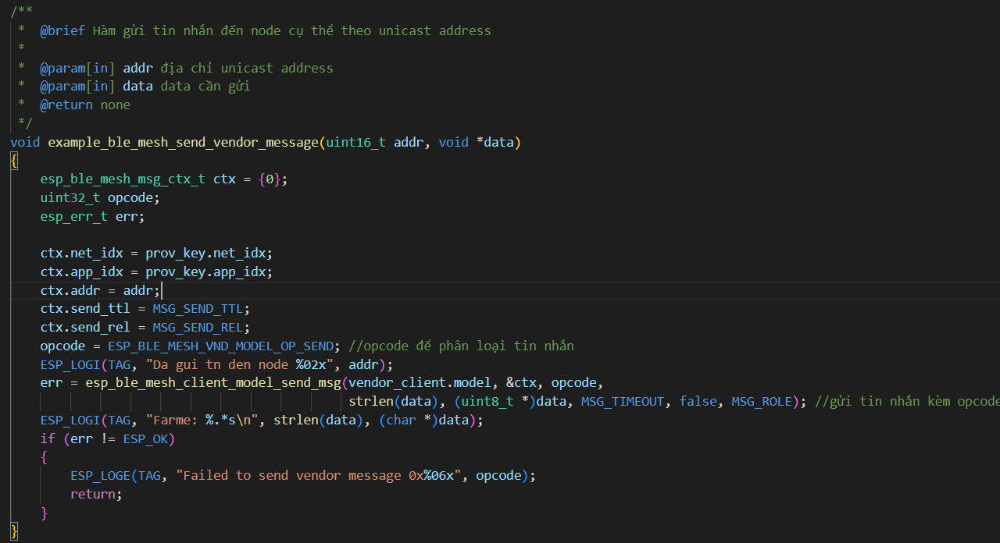

| Supported Targets | ESP32 |
| ----------------- | ----- |

Link GitHub: https://github.com/BungVuQuang/wsn_gateway
# Giới thiệu chung
Dự án này được viết nhằm mục đích tạo ra 1 gateway sử dụng công nghệ BLE để truyền nhận tin nhắn giữa các node
Gateway sẽ được cấp nguồn điện và mạng

  ---

# Yêu cầu hệ thống

1. Phiên bản ESP-IDF từ 3.5 trở lên

---
# Cài đặt tính năng trong Menuconfig
Bật các tính năng như trong hình trong menuconfig

---
# Cài đặt wifi ban đầu cho Gateway
Khi chưa khởi tạo lần đầu cho ESP-32 thì nó sẽ chạy ở chế độ Access Point.Sau đó gửi request đến AP bằng cách truy cập [192.168.4.1/hello](192.168.4.1/hello)

SSID:SSID of Router   
Password:Mật khẩu of Router 

=>Sau khi kết nối thành công ESP-32 sẽ lưu lại SSID và Password cho lần đăng nhập sau. 

---
# Hướng dẫn sử dụng code

#### Khởi tạo Bluetooth Controller, Bluetooth Mesh và xét trạng thái của Wifi
- Lấy lại thông tin wifi đã lưu
- Khôi phục lại thông tin của các node
- Xét trạng thái của wifi để chạy Access Point hoặc Station
- Tạo UUID 128 bit cho Gateway

---

#### Đăng ký các hàm Callback xử lý Event nhận được.
- Khi có các Event liên quan đến Provisioning, Config Client,Sensor Client thì nó sẽ gọi lại các hàm được truyền vào tham số.
- Set match UUID khi phát hiện các gói quảng cáo
- Khởi tạo Ble Mesh Init
- Bắt đầu Scan các gói tin quảng cáo

---

#### Kết nối đến Router 
- Hàm này sẽ đăng ký function callback (event_handler) để xử lý các sự kiện liên quan đến quá trình kết nối mạng
- Kết nối đến Router dựa vào SSID và Password do người dùng cung cấp.

---

#### Hàm xử lý các sự kiện liên quan đến quá trình kết nối mạng

---

#### Gửi thông tin về Sensor Modlel của Gateway đến Node vừa được cấp phép vào mạng
- Các node sẽ dựa vào thông tin này để gửi tin nhắn đến cho Gateway

---

#### Cấp phép 1 node nếu như UUID đúng định dạng
- Gateway sẽ dựa vào UUID có trong bản tin quảng cáo của Node để xem nó có phải là thiết bị trong mạng hay không.Nếu đúng nó sẽ gửi yêu cầu cấp phép đến.

---

#### Xử lý các sự kiện liên quan đến quá trình cấp phép 1 node vào mạng
- Hàm này được gọi lại khi có sự kiện cấp phép 1 node
- Ngoài sự kiện ESP_BLE_MESH_PROV_REGISTER_COMP_EVT, thì các sự kiện khác chỉ được gọi khi phát hiện bản tin quảng cáo đúng định dạng UUID mà nó match.

---

#### Gửi tin nhắn đến 1 node
- Gateway sẽ gửi tin nhắn đến 1 node cụ thể trong mạng dựa vào Unicast Address.
- Các node sẽ dựa vào opcode để phân loại tin nhắn gửi đến

---

#### Khởi động MQTT kết nối đến HiveMQ
- Kết nối đến MQTT Broker HiveMQ

---

#### Xử lý các sự kiện liên qua đến MQTT
- Hàm này sẽ được gọi lại nếu như có sự kiện có tin nhắn gửi đến topic subcribe trước đó
- Gateway sẽ dựa vào tin nhắn của người dùng để xử lý

---
#### Gửi bản tin Publish lên Broker
- Khi nhận được tin nhắn từ node gửi lên thì gateway sẽ đóng gói dữ liệu theo định dạng JSON để publish

